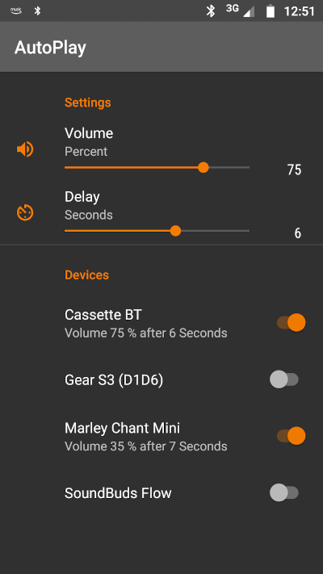

# autoplay
Start media playback on bluetooth connection

This app is a rewritten version of [this](https://github.com/DaveOddy/AutoPlay), with the option of selecting multiple bluetooth devices. Bluetooth is automatically started, and a media playback event is sent to the currently active (but paused) music app.

